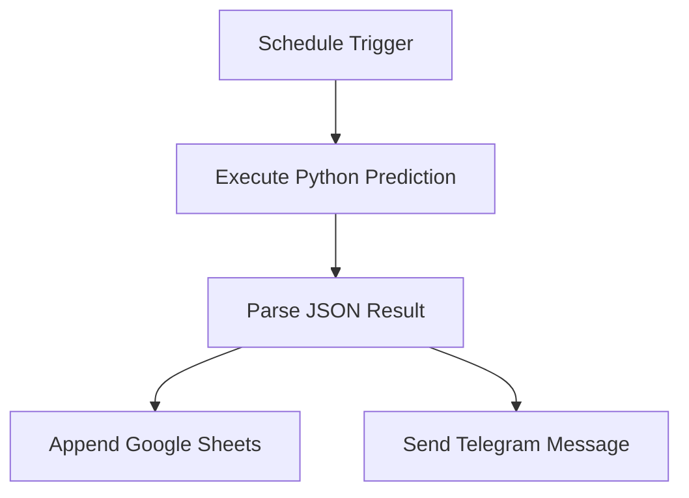

# 발표 자료 구성안

## 1. 프로젝트 주제

General Electric(`GE`) 주가 데이터를 활용해 다음 거래일 수익률을 예측하고, 이를 예상 종가로 환산해 n8n으로 자동 리포트를 발송하는 서비스입니다.

## 2. 문제 정의

주식 가격은 불확실성이 크지만, 과거 가격·거래량·기술적 지표를 활용하면 단기적인 수익률 움직임을 회귀 문제로 모델링할 수 있습니다.

예측 대상:

- 입력: 과거 OHLCV와 기술적 지표
- 출력: 다음 거래일 수익률

## 3. 데이터 수집

- 데이터 출처: Yahoo Finance
- 티커: `GE`
- 기간: 2014년 이후 일봉 데이터
- 수집 도구: `yfinance`
- 주요 컬럼: `Open`, `High`, `Low`, `Close`, `Adj Close`, `Volume`

## 4. 전처리

- 날짜 정렬 및 중복 제거
- 결측치 제거
- 다음 거래일 수익률과 다음 거래일 종가 타깃 생성
- 학습/테스트 데이터 분리
- `MinMaxScaler` 정규화

## 5. Feature Engineering

- 이동평균: 5일, 10일, 20일, 60일
- 변동성: 5일, 20일 수익률 표준편차
- RSI(14)
- MACD, MACD Signal, MACD Histogram
- Bollinger Band 위치와 폭
- 거래량 이동평균과 거래량 변화율
- 전일 종가 대비 시가 갭

## 6. 모델

Dense Regression:

- 여러 개의 Dense layer와 Dropout 사용
- 손실 함수: MSE
- Optimizer: Adam
- 출력: 다음 거래일 수익률

LSTM Regression:

- 최근 30거래일 시퀀스 입력
- 시계열 패턴 반영
- Dense 모델과 성능 비교

## 7. 평가

비교 대상:

- Baseline: 오늘 종가를 내일 종가로 예측
- TensorFlow Dense Regression
- TensorFlow LSTM Regression

평가 지표:

- MAE
- RMSE
- MAPE

시각화:

- 학습 loss 그래프
- 실제 종가 vs 예측 종가 그래프

## 8. n8n 서비스화

자동화 흐름:

## 9. 한계점

- 주식 가격은 외부 이벤트에 크게 영향을 받습니다.
- 뉴스, 실적 발표, 금리, 시장 심리 등은 현재 모델에 포함되지 않았습니다.
- 예측 결과는 교육용 실험이며 투자 조언이 아닙니다.

## 10. 개선 방향

- 뉴스 감성분석 추가
- S&P 500, VIX, 미국 금리 데이터 추가
- 여러 모델의 앙상블 적용
- Streamlit 대시보드 구축
- n8n Webhook으로 사용자 요청 시 즉시 예측 제공
